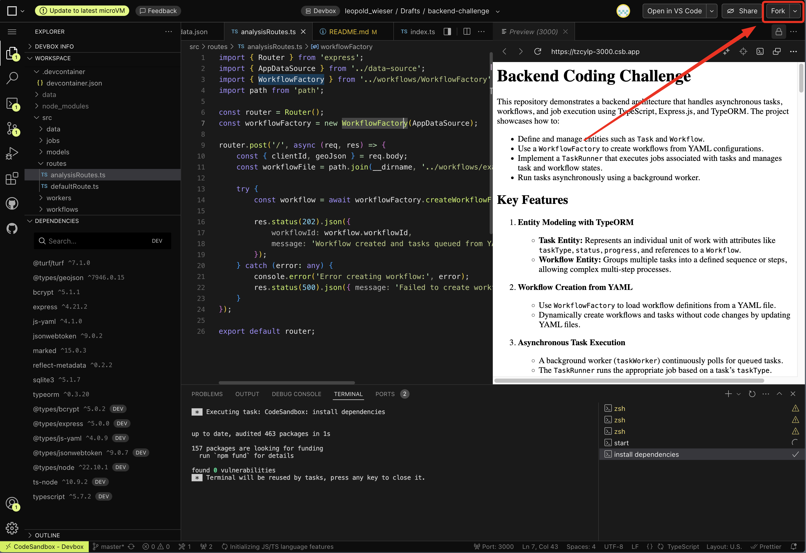

# Backend Coding Challenge

## Getting Started

1. Fork the Project:
   
2. Start Coding

This repository demonstrates a backend architecture that handles asynchronous tasks, workflows, and job execution using TypeScript, Express.js, and TypeORM. The project showcases how to:

- Define and manage entities such as `Task` and `Workflow`.
- Use a `WorkflowFactory` to create workflows from YAML configurations.
- Implement a `TaskRunner` that executes jobs associated with tasks and manages task and workflow states.
- Run tasks asynchronously using a background worker.

## Key Features

1. **Entity Modeling with TypeORM**

   - **Task Entity:** Represents an individual unit of work with attributes like `taskType`, `status`, `progress`, `output`, and optional `dependsOnTaskId` reference.
   - **Workflow Entity:** Groups multiple tasks into a defined sequence or steps. Stores a `finalResult` once all tasks reach a terminal state.

2. **Workflow Creation from YAML**

   - Use `WorkflowFactory` to load workflow definitions from a YAML file.
   - Dynamically create workflows and tasks without code changes by updating YAML files.
   - Support for inter-task dependencies via `dependsOn: <stepNumber>` in the YAML.

3. **Asynchronous Task Execution**

   - A background worker (`taskWorker`) continuously polls for `queued` tasks.
   - Tasks are picked in ascending `stepNumber` order and gated on dependency completion.
   - The `TaskRunner` runs the appropriate job based on a task's `taskType`.

4. **Robust Status Management**

   - `TaskRunner` updates the status of tasks (`queued` → `in_progress` → `completed` / `failed`).
   - Workflow status is always reconciled after each task — including on failure.
   - Once all tasks reach a terminal state, the workflow's `finalResult` is written.

5. **Dependency Injection and Decoupling**
   - `TaskRunner` takes in only the `Task` and determines the correct job internally.
   - `TaskRunner` handles task state transitions, leaving the background worker clean and focused.

## Project Structure

```
src
├─ data/
│   └─ world_data.json       # Contains world data for geo analysis
│
├─ models/
│   ├─ Result.ts             # Result entity (back-compat output store)
│   ├─ Task.ts               # Task entity (includes output, dependsOnTaskId)
│   └─ Workflow.ts           # Workflow entity (includes finalResult)
│
├─ jobs/
│   ├─ Job.ts                # Job interface (with JobContext for dependency outputs)
│   ├─ JobFactory.ts         # Maps taskType → Job implementation
│   ├─ TaskRunner.ts         # Job execution, state transitions, workflow reconciliation
│   ├─ DataAnalysisJob.ts    # Determines which country a polygon lies within
│   ├─ EmailNotificationJob.ts # Stub notification job
│   ├─ PolygonAreaJob.ts     # NEW – calculates polygon area via @turf/area
│   └─ ReportGenerationJob.ts # NEW – aggregates outputs of preceding tasks
│
├─ workflows/
│   ├─ WorkflowFactory.ts    # Creates workflows & tasks from a YAML definition
│   ├─ example_workflow.yml  # 3-step chain: polygonArea → analysis → reportGeneration
│   └─ report_workflow.yml   # Alternative: polygonArea → notification → reportGeneration
│
├─ workers/
│   └─ taskWorker.ts         # Polls for queued tasks in stepNumber order
│
├─ routes/
│   ├─ analysisRoutes.ts     # POST /analysis — create a workflow
│   └─ workflowRoutes.ts     # NEW – GET /workflow/:id/status and /results
│
├─ data-source.ts            # TypeORM DataSource (sql.js driver)
└─ index.ts                  # Express server bootstrap + worker start
```

## Getting Started

### Prerequisites

- Node.js 20+ (LTS recommended; tested on Node 24)
- npm

### Installation

1. **Clone the repository:**

   ```bash
   git clone https://github.com/yourusername/backend-coding-challenge.git
   cd backend-coding-challenge
   ```

2. **Install dependencies:**

   ```bash
   npm install --registry https://registry.npmjs.org
   ```

   > **Note:** This project uses [`sql.js`](https://github.com/sql-js/sql.js) (a WebAssembly SQLite port) instead of the native `sqlite3` driver, so no C++ compiler is required.

3. **Start the server:**

   ```bash
   npm start
   ```

   This starts the Express server on port 3000 and the background task worker.

4. **Run the tests:**

   ```bash
   npm test
   ```

---

## API Reference

### POST /analysis

Creates a new workflow from the default YAML definition (`example_workflow.yml`).

**Request body:**

```json
{
  "clientId": "client123",
  "geoJson": {
    "type": "Feature",
    "geometry": {
      "type": "Polygon",
      "coordinates": [[[
        -63.624885020050996, -10.311050368263523
      ],[
        -63.624885020050996, -10.367865108370523
      ],[
        -63.61278302732815, -10.367865108370523
      ],[
        -63.61278302732815, -10.311050368263523
      ],[
        -63.624885020050996, -10.311050368263523
      ]]]
    },
    "properties": {}
  }
}
```

**Response `202 Accepted`:**

```json
{
  "workflowId": "3433c76d-f226-4c91-afb5-7dfc7accab24",
  "message": "Workflow created and tasks queued from YAML definition."
}
```

---

### GET /workflow/:id/status

Returns the current status of a workflow including task-completion counters.

**Response `200 OK`:**

```json
{
  "workflowId": "3433c76d-f226-4c91-afb5-7dfc7accab24",
  "status": "in_progress",
  "completedTasks": 1,
  "totalTasks": 3
}
```

**Response `404 Not Found`:** workflow ID does not exist.

---

### GET /workflow/:id/results

Returns the aggregated `finalResult` of a **completed** workflow.

**Response `200 OK`** (workflow completed):

```json
{
  "workflowId": "3433c76d-f226-4c91-afb5-7dfc7accab24",
  "status": "completed",
  "finalResult": {
    "workflowId": "3433c76d-f226-4c91-afb5-7dfc7accab24",
    "status": "completed",
    "tasks": [
      {
        "taskId": "...",
        "type": "polygonArea",
        "stepNumber": 1,
        "status": "completed",
        "output": { "areaSqMeters": 8363324.27 },
        "error": null
      },
      {
        "taskId": "...",
        "type": "analysis",
        "stepNumber": 2,
        "status": "completed",
        "output": "Brazil",
        "error": null
      },
      {
        "taskId": "...",
        "type": "reportGeneration",
        "stepNumber": 3,
        "status": "completed",
        "output": { "workflowId": "...", "tasks": [...], "finalReport": "All 2 preceding tasks completed successfully." },
        "error": null
      }
    ]
  }
}
```

**Response `400 Bad Request`:** workflow is not yet completed (includes `status` and any partial `finalResult`).

**Response `404 Not Found`:** workflow ID does not exist.

---

## Workflow YAML Format

Workflows are defined in YAML files under `src/workflows/`. The format is:

```yaml
name: "my_workflow"
steps:
  - taskType: "polygonArea"     # job type key
    stepNumber: 1               # determines execution order

  - taskType: "analysis"
    stepNumber: 2
    dependsOn: 1                # waits for stepNumber 1 to complete

  - taskType: "reportGeneration"
    stepNumber: 3
    dependsOn: 2                # waits for stepNumber 2 to complete
```

### Available job types

| `taskType`         | Description                                          |
|--------------------|------------------------------------------------------|
| `polygonArea`      | Calculates area (m²) of the GeoJSON polygon via `@turf/area`. Fails on invalid GeoJSON. |
| `analysis`         | Determines which country the polygon lies within. |
| `notification`     | Stub: simulates sending an email (500 ms delay). |
| `reportGeneration` | Aggregates outputs of all preceding tasks into a JSON report. Must be the last step. |

### Dependency rules

- `dependsOn` references the `stepNumber` of a prerequisite task.
- A task only becomes eligible once its dependency reaches `completed`.
- If a dependency **fails**, the dependent task is also immediately marked `failed` (cascade).

---

## Testing

Run the full test suite:

```bash
npm test
```

Coverage includes:
- `PolygonAreaJob`: valid polygon returns area; invalid GeoJSON and non-polygon geometry throw.
- `WorkflowFactory`: parses `dependsOn` and wires `dependsOnTaskId` correctly; throws on bad references.
- `TaskRunner`: completed task persists `output`; failed task sets `progress`; `finalResult` is written on terminal state; dependency cascade works.
- `workflowRoutes`: all 404 / 400 / 200 paths for `/status` and `/results`.

---

## Quick curl demo

```bash
# 1. Start the server
npm start

# 2. Create a workflow
curl -X POST http://localhost:3000/analysis \
  -H "Content-Type: application/json" \
  -d '{
    "clientId": "demo",
    "geoJson": {
      "type": "Feature",
      "geometry": {
        "type": "Polygon",
        "coordinates": [[[
          -63.6249,-10.3111],[-63.6249,-10.3679],
          [-63.6128,-10.3679],[-63.6128,-10.3111],
          [-63.6249,-10.3111]]]
      },
      "properties": {}
    }
  }'
# → {"workflowId":"<ID>","message":"..."}

# 3. Poll status
curl http://localhost:3000/workflow/<ID>/status

# 4. Get results once completed (retry until 200)
curl http://localhost:3000/workflow/<ID>/results
```

> The worker polls every **5 seconds** and the 3-task example workflow completes in ~15–20 seconds.
